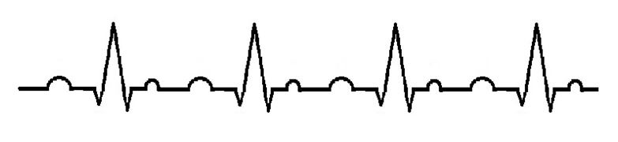
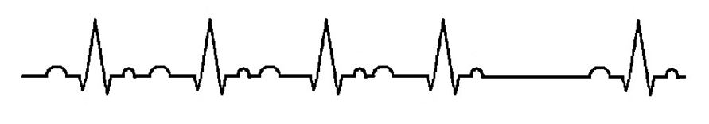
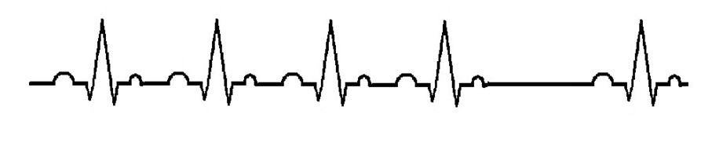
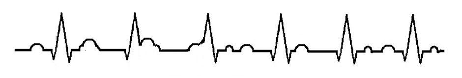
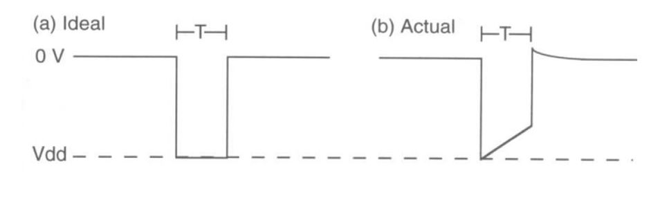
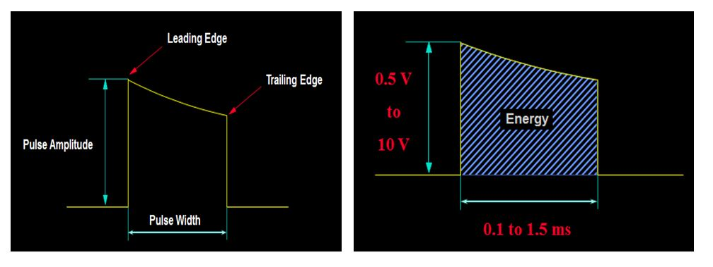
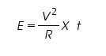
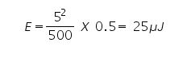

### Theory

Major use of medical electronics are as a diagnostic tool. Most instruments sense, record and display a physiological signal. There are some therapeutic and prosthetic devices which are used as a means of treating human ailments.

For e.g.

Electric stimulators, ventilators, heart-lung machines, artificial organs, prosthetic devices, implantable devices, drug delivery pumps (e.g. insulin pump), etc.

There are two common and important electric stimulator devices used to detect and correct arrhythmias

* Cardiac Pacemakers
* Cardiac Defibrillators

**What is a pacemaker?**

A pacemaker is an electronic device that provides an electrical signal to make the heart beat when it's own, built-in pacemakers fail. The anatomical, built-in pacemakers provide what's called the "intrinsic" rhythm, and they can be disrupted by various conditions - ischemia for example, or by an MI.
It is prosthetic device for the heart, first conceived in 1932 by Albert S. Hymen, an American cardiologist. In 1952 the pacemaker was used clinically by Paul M. Zoll as an external device.

**What is cardiac arrhythmia?**

Abnormality in cardiac normal rhythm is called cardiac arrhythmia.There are various types of cardiac disorder. Some of them are Bradicardia and tachycardia. In bradycardia heart rate goes down from normal rate(i.e. below 60) and in tachycardia heart rate is higher than normal rate.

There are several reasons for cardiac arrhythmia. One of the reason for arrhythmia is blockage in conduction path.Heart block can occur anywhere in the specialized conduction system beginning with the sino-atrial connections, the AV junction, the bundle branches and their fascicles, and ending in the distal ventricular Purkinje fibers. Disorders of conduction may manifest as slowed conduction (1st degree), intermittent conduction failure (2nd degree), or complete conduction failure (3rd degree).

Here some examples given for various degree of AV node block.

**first degree AV block**

This is a fairly simple and subtle AV block caused by the delay of the impulse at the diseased AV node. It is reflected in the PR interval, which the is part of the waveform measured from the beginning of the P wave to the beginning of the QRS complex. In a healthy heart the PR interval is 0.2 seconds in length.

The second degree blocks are broken into two types. We will look at each one individually…

The second degree type I, also known as the Mobitz Type I or the Wenckebach, is where the impulse is delayed at the AV node longer than usual, increasing the interval until eventually the AV node fails to conduct the impulse on. The result is a "dropped" beat. This is commonly taught as the "going, going, going, gone" block. This block is the less dangerous of the two second degree blocks, but should be monitored appropriately.

The second degree type II, Also known as the Mobitz Type II or the Hay, is a disease of the distal conduction system where it simply fails to conduct a beat. There is no set pattern to how often or when it will occur. This is most dangerous of the second degree blocks because the AV node may drop a beat and progress into a complete heart block or fail to generate an escape beat, resulting in cardiac arrest.

The third degree block is the most dangerous of the three types. It is where the SA node and the AV node are working out of sync. The SA node is still sending an impulse, but the AV node is not picking it up and the Bundle of His is generating escape beats in order to keep the ventricles operating. This will be recognized in the ECG as two separate rhythms. The P-P interval (measurement from P wave to P wave) will show one rhythm and the R-R interval will show another.

Here we have seen different kind of cardiac disorder.

**Pacemaker classification:**

Pacemaker can classified in two category
1. External pacemaker
2. Implantable pacemaker

Based on cardiac disorder physician decide which pacemaker to be used.If pacemaker requires temporary to correct cardiac rhythm then external pacemaker is used but if pacemaker require permanent than implantable pacemaker is used.

Again pacemaker can be classified in two type

**Asynchronous pacemaker :**

Asynchronous device is free-running-Produces uniform stimulation regardless of cardiac activity (i.e. fixed heart-rate)
This type of pacemaker is intended for patients having permanent heart blocks. The rate is preset.
It can be varied externally within the range of 60 PPM to 180 PPM. Since this pacemaker
functions regardless of the patient's natural heart rhythm it poses a potential danger because of
competition between the patient's rhythm and that of the pacemaker

**Synchronous pacemaker:**

In patients who have normal heart function most of the time, asynchronous pacing can be extremely dangerous, working against their own physiological pacemaker with the danger of stimulating in the vulnerable period of the T wave, a condition that can result in fibrillation.
The demand pacemaker consists of an ECG amplifier and a conventional pacemaker output pulse circuit that has been modified to allow output from the ECG amplifier to inhibit the pulse generator. This pacemaker senses R-waves and its timing and logic circuits count out an elapsed time interval following an R-wave or previously induced pulse. If the intrinsic R-wave does not appear before the elapsed time interval, the ventricle is stimulated. If an R-wave is received, the counter is reset again. This type of pacemaker is used for patients with bradycardia, and it ensures a heartbeat no slower than its set rate.

**Intended use:**

It can be used when the short term demand or asynchronous pacing is indicated for therapeutic,
prophylactic or diagnostic purposes.
* Complete heart block
* Sinus Bradychardia
* Sick sinus syndrome
* Bradycardia with congestive heart failure
* Atrial/Ventricular arrhythmias
* Cardiac arrest
* Support during permanent pacemaker replacement
* Cardiac complication during invasive or surgical procedure
* Acute myocardial infarction applition by heart block
* High rate burst pacing for the treatment of supraventriculrtrachy-arrhythmias

**Asynchronous pacemaker:**

Block diagram showsvarious components of asynchronous pacemaker

* Power supply - provides energy
* Oscillator - controls pulse rate
* Pulse output - produces stimuli
* Lead wires - conduct stimuli
* Electrodes - transmit stimuli to the tissue

Output circuit produces the electrical stimuli to be applied to the heart
* Stimulus generation is triggered by the timing circuit
* Constant-voltage pulses
       - Typically rated at 5.0 to 5.5V for 500 to 600μs
* Constant-current pulses
       - Typically rated at 8 to 10mA for 1.0 to 1.2ms
* Asynchronous pacing rates -70 to 90 beats per min

Figure show the ideal wave form and realistic waveform of output circuit of pacemaker.
Realistic depiction of waveform appearing across heart emitted from capacitor discharge output circuit.

**Stimulus energy:**

Energy calculation: Energy of stimulus is calculated from below given formula

Example : 5 V, 500 Ohm , 0.5 ms

